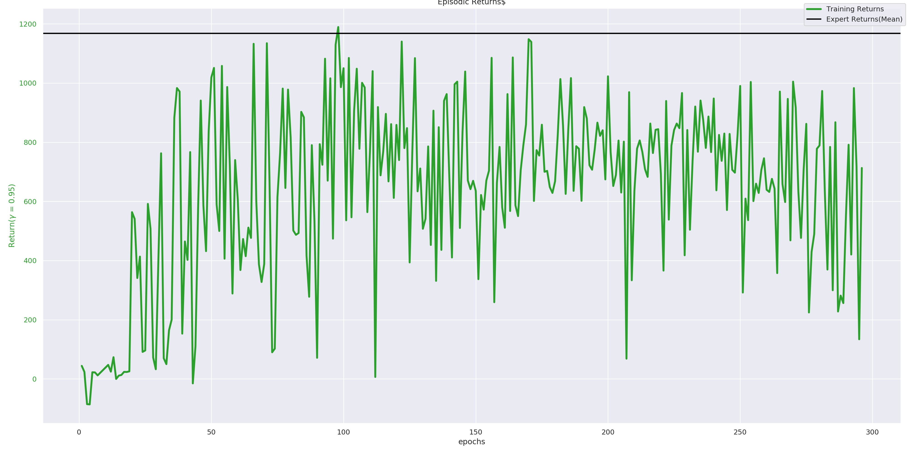

## summary( general idea  of the  project )


# TORCS-GAIL: Deterministic Generative Adversarial Imitation Learning for TORCS

This project implements a Generative Adversarial Imitation Learning (GAIL) framework using the TORCS simulator. The primary goal is to train an agent to mimic expert driving behavior using adversarial learning.

---

## **Directory Structure**

### **Core Code Files**
- **`actor.py`**  
  Implements the actor network in the GAIL framework, responsible for generating actions based on the learned policy.

- **`discriminator.py`**  
  Implements the discriminator network, which distinguishes between expert trajectories and agent-generated trajectories. It provides feedback to improve the actor's policy.

- **`gail.py`**  
  Combines the actor and discriminator into the GAIL framework. Handles training loops and optimization.

- **`getexptraj.py`**  
  Script for collecting expert trajectories from TORCS, providing training data for the discriminator.

- **`gym_torcs.py`**  
  Implements a custom Gym interface for TORCS, defining the action/observation spaces and interaction logic.

- **`snakeoil3_gym.py`**  
  Contains utilities or wrappers for interacting with the TORCS simulator.

- **`utility.py`**  
  Includes helper functions for logging, saving/loading models, and other utilities.

---

### **Training and Testing**
- **`train.py`**  
  Script to train the GAIL framework. Initializes the actor, discriminator, and handles the training process.

- **`test.py`**  
  Script to evaluate the trained GAIL model in TORCS, measuring performance and logging results.

- **`playexpert.py`**  
  Demonstrates expert driving behavior in TORCS, used to generate expert trajectories or for validation.

---

### **Pretrained Weights and Logs**
- **`weights/`**  
  Contains pretrained model weights:
  - `GAIL_actor.pth`: Actor network parameters.
  - `GAIL_discriminator.pth`: Discriminator network parameters.

- **`logs/`**  
  Stores training and testing logs for TensorBoard visualization. Logs are organized into experiments and testing sessions.

---

### **Results**
- **`Results/`**  
  - `gail-demo.gif` and `gail-demo.mp4`: Visual demonstrations of the trained agent's behavior.  
  - `returns.png`: Plot of training returns (rewards) over time.

---

### **Miscellaneous**
- **`autostart.sh`**  
  Shell script to automate starting TORCS and its dependencies.
---

## **Project Workflow**

### 1. **Data Collection**
Use `getexptraj.py` with `gym_torcs.py` to collect expert driving trajectories from TORCS. These trajectories are required to train the discriminator.

### 2. **Training**
Run `train.py` to train the GAIL model:
- Actor learns to mimic expert behavior.
- Discriminator provides feedback to distinguish expert and generated trajectories.

### 3. **Testing**
Evaluate the trained GAIL model using `test.py`. This measures the policy's performance and verifies its ability to replicate expert driving.

### 4. **Visualization**
Check logs in `logs/` using TensorBoard for performance analysis. Use `Results/` for visual demonstrations of the agent's behavior.

---

## **Dependencies**

- Python 3.x
- TORCS Simulator (ensure it is properly installed)
- Required Python libraries:
  - TensorFlow/PyTorch
  - OpenAI Gym
  - Other dependencies as specified in the code.

---

## **Usage Instructions**

### Collect Expert Trajectories
```bash
python getexptraj.py --locs '[DR_USA_Roundabout_FT]' --tracks '[0,1,2,3,4]'
```

# Deterministic Generative Adverserial Imitation learning with TORCS
# RESULTS 


| Expert Demo                 |  GAIL Demo              |
:----------------------------:|:-------------------------:
  |     

### Returns (Training)

